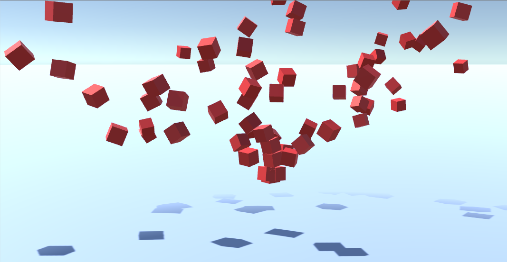

# Object pooling pattern in Unity

Original example code from Brackeys (https://www.youtube.com/watch?v=tdSmKaJvCoA)

https://www.youtube.com/user/Brackeys/about

PD: added minor optimizations, enum, interface, etc.

