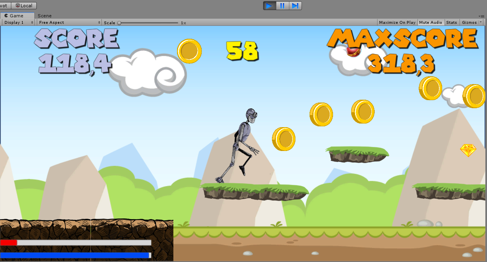

# Project in Unity created following the classes of Videogame Development Course with Unity 2018 and C# at Udemy

One of the tutorials dedicated to creating a 2D enless side scroller game, by Juan Gabriel Gomila (https://twitter.com/@Joan_By) at Udemy:
"Learn how to program videogames at a professional level from scratch, mastering all the essential bases of Unity 2018".

